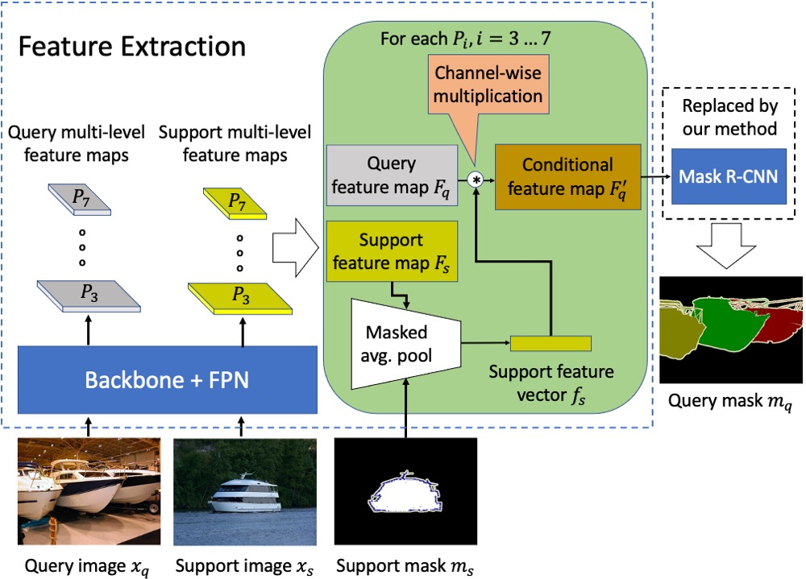

# FAPIS


The official implementation of the CVPR 2021 paper [FAPIS: a Few-shot Anchor-free Part-based Instance Segmenter](https://arxiv.org/abs/2104.00073)



## Introduction

This repo is primarily based on the Pytorch implementation of [Siamese Mask-RCNN](https://arxiv.org/abs/1811.11507) and we use [mmdetection](https://github.com/open-mmlab/mmdetection) toolbox to finish it.

The official code of Siamese Mask-RCNN can be found in [siamese mask-rcnn](https://github.com/bethgelab/siamese-mask-rcnn)

## Installation

Please follow the installation in **README_mmdetection.md**, to compile the necessary libraries, please read the [compile.sh](compile.sh) file 

## Prepare COCO dataset

```shell
ln -s $path/to/coco data/coco
```

## Training

Please read [train_FAPISv2.sh](train_FAPISv2.sh) for some sample commands

## Testing

Please read [test_FAPISv2.sh](test_FAPISv2.sh) for some sample commands

and run [run.sh](run.sh) the results will be saved in results.txt file

## Visualize the results 

```shell
python tools/test.py configs/FAPISv2_fcos_r50_caffe_fpn_gn_1x_4gpu.py work_dirs/FAPISv2_fcos_use_rf_mask_constrain_parts_unet_dist_part_0/latest.pth --show
```

## Citation

Our paper: 

```
@inproceedings{nguyen2021fapis,
  title={FAPIS: A Few-shot Anchor-free Part-based Instance Segmenter},
  author={Nguyen, Khoi and Todorovic, Sinisa},
  booktitle={Proceedings of the IEEE/CVF Conference on Computer Vision and Pattern Recognition},
  pages={11099--11108},
  year={2021}
}
```

The Siamese Mask-RCNN paper:

```
@article{michaelis_one-shot_2018,
    title = {One-Shot Instance Segmentation},
    author = {Michaelis, Claudio and Ustyuzhaninov, Ivan and Bethge, Matthias and Ecker, Alexander S.},
    year = {2018},
    journal = {arXiv},
    url = {http://arxiv.org/abs/1811.11507}
}
```

This project is based on [mmdetection](https://github.com/open-mmlab/mmdetection) toolbox.

```
@article{mmdetection,
  title   = {{MMDetection}: Open MMLab Detection Toolbox and Benchmark},
  author  = {Kai Chen, Jiaqi Wang, Jiangmiao Pang, Yuhang Cao, Yu Xiong, Xiaoxiao Li,
             Shuyang Sun, Wansen Feng, Ziwei Liu, Jiarui Xu, Zheng Zhang, Dazhi Cheng,
             Chenchen Zhu, Tianheng Cheng, Qijie Zhao, Buyu Li, Xin Lu, Rui Zhu, Yue Wu,
             Jifeng Dai, Jingdong Wang, Jianping Shi, Wanli Ouyang, Chen Change Loy, Dahua Lin},
  journal = {arXiv preprint arXiv:1906.07155},
  year    = {2019}
}
```

Thanks for their contributions
