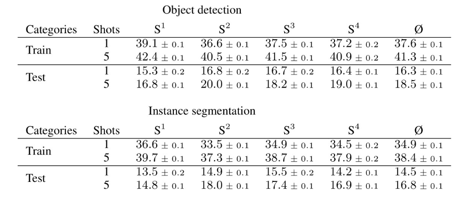
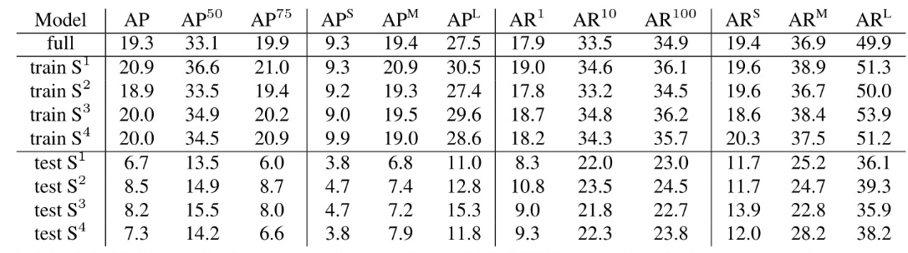

## Evaluation details

#### 类别选取

**一定要区别好4个split，test-set，train-set，三者都是对于category而言的**

**The evaluation is performed on the MS Coco 2017 validation set，相当于2014年minval set**

60类train，20类test。  test选每第四类

4个子subtask。{i+4*k for k in range(20)}  i = 0 1 2(train), 3(test)   （任务类别）

#### val流程

每一个子任务（类别集）都在整个测试集中进行测试。

对每个类别，从所有instance中随机选择一个作为reference。

对每张图片，选取的一个reference都相互独立（相当于每张图片随机选一个）

如果一张图片中没有该子任务的任何一个类别，则该图片被该子任务跳过

跑完一个子任务后，图片中的bounding box只有该子任务中提及到的类别

#### 随机采样引起的噪声

For our model the **std** of the predicted results is 1%.？

对每个子split，run5次，达到0.2%标准误差

#### NMS

non-maximum suppression (NMS) on the predictions of each image/references combination
individually

not on the combined output of an image after running the detection for all references

#### mAP50

mAP50 is evaluated at a single Intersection over Union (IoU) threshold of 50% between predicted and the ground truth bounding boxes

#### Confusion matrix

(i,j)上的元素：假设类别i的reference image属于类别j，得到的类别i的AP50，如果没有假正例，则非对角线上的mAP50应该为0。

#### one shot 结果（

##### 总体结果（95%置信区间）

##### detection结果（5次均值）

##### segmentation结果（5次均值）

第二列重要，fiveshot的具体结果见原文